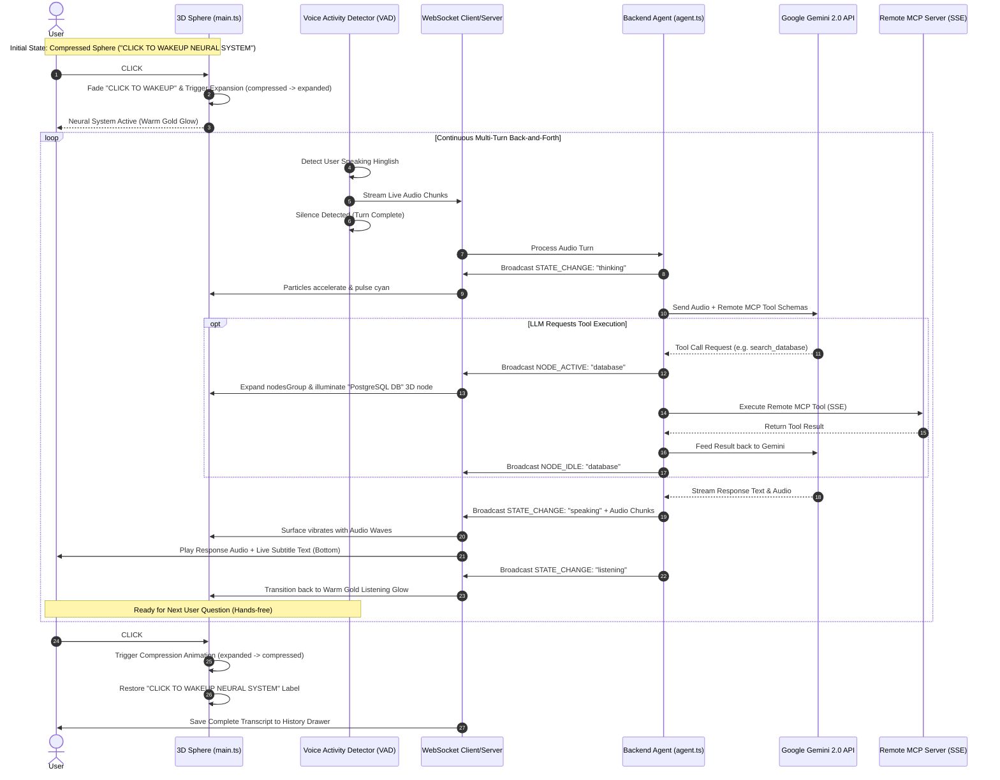

# Conversational Agent Architecture Implementation Plan

Transform the 3D sphere visualization into a real-time interactive Continuous Conversational Voice Agent. The agent seamlessly integrates with the newly overhauled 3D UI (featuring volumetric sphere shells, breathing animations, smooth expansion/compression states, and the **"CLICK TO WAKEUP NEURAL SYSTEM"** interaction).

---

## 1. Integration with Latest UI Enhancements

The updated UI introduces a dormant sphere state with a pulsing **`CLICK TO WAKEUP NEURAL SYSTEM`** label and smooth 3D expansion/compression animations. Our continuous voice session directly maps onto these visual states:

| System State | 3D Visual State | UI & Audio Behavior |
| :--- | :--- | :--- |
| **Dormant / Idle** | `compressed` | Pulsing `CLICK TO WAKEUP NEURAL SYSTEM` label visible. |
| **Click #1 (Start Session)** | `expanding` $\rightarrow$ `expanded` | Label fades out; sphere shells expand; VAD mic session opens (`listening`). |
| **User Speaking** | `expanded` + breathing | Audio recorded; bottom subtitle reads live user transcript. |
| **AI Thinking & MCP Call** | `expanded` + cyan pulse | Nodes expand (`nodesState: expanding`); active MCP tool node illuminates. |
| **AI Speaking** | `expanded` + wave ripple | AI audio streams; 3D surface vibrates; subtitles update live at bottom. |
| **Click #2 (End Session)** | `compressing` $\rightarrow$ `compressed` | Sphere contracts to core; VAD closes; `CLICK TO WAKEUP` label restores; transcript saved. |

---

## 2. End-to-End Continuous Session Workflow Diagram



---

## 3. Environment Configuration (`backend/.env`)

Placeholders ready for your Gemini API key and Remote MCP Server URL:

```env
# Backend Server Port
PORT=8080

# Primary LLM Provider
LLM_PROVIDER=gemini

# Google Gemini API Key (Get free key from https://aistudio.google.com/app/apikey)
GEMINI_API_KEY=YOUR_GEMINI_API_KEY_HERE

# Deployed Remote MCP Server SSE Endpoint
REMOTE_MCP_SERVER_URL=https://your-mcp-server.com/sse
```

---

## 4. Proposed File Changes

---

### Backend Components (`backend/`)

#### [MODIFY] [package.json](file:///Users/krush/Desktop/Sphere-Visualization/backend/package.json)
- Add dependencies: `@google/genai`, `@modelcontextprotocol/sdk`, `@types/node`, `dotenv`.

#### [NEW] [.env](file:///Users/krush/Desktop/Sphere-Visualization/backend/.env)
- Configuration template with placeholder API keys and MCP URL.

#### [NEW] [mcpClient.ts](file:///Users/krush/Desktop/Sphere-Visualization/backend/src/mcpClient.ts)
- Connect to remote MCP server SSE endpoint using `@modelcontextprotocol/sdk/client/sse.js`.
- Discover tools dynamically and convert them into Gemini function declaration schemas.
- Execute remote MCP tool calls.

#### [NEW] [agent.ts](file:///Users/krush/Desktop/Sphere-Visualization/backend/src/agent.ts)
- Manage multi-turn conversational loop, Gemini 2.0 Multimodal audio/text context, and MCP tool execution.

#### [MODIFY] [server.ts](file:///Users/krush/Desktop/Sphere-Visualization/backend/src/server.ts)
- Bind WebSocket client connections to real-time agent events.

---

### Frontend Components (`frontend/`)

#### [MODIFY] [main.ts](file:///Users/krush/Desktop/Sphere-Visualization/frontend/src/main.ts)
- Integrate session state machine with the new `sphereState` (`compressed` $\rightarrow$ `expanding` $\rightarrow$ `expanded` $\rightarrow$ `compressing`):
  - **Click #1**: Expands sphere from compressed state, hides `#start-label`, and opens VAD voice session.
  - **Click #2**: Compresses sphere back, restores `#start-label`, and ends session.
  - **WebSocket Handlers**: Unhide and illuminate 3D service nodes (`nodesGroup`) when `NODE_ACTIVE` events arrive during MCP tool calls.

#### [MODIFY] [index.html](file:///Users/krush/Desktop/Sphere-Visualization/frontend/index.html)
- Integrate subtitle overlay bar beneath the sphere.
- Add collapsible persistent chat history reader drawer.

#### [NEW] [audioRecorder.ts](file:///Users/krush/Desktop/Sphere-Visualization/frontend/src/audioRecorder.ts)
- Voice Activity Detection (VAD) module for continuous hands-free turn taking.

#### [NEW] [wsClient.ts](file:///Users/krush/Desktop/Sphere-Visualization/frontend/src/wsClient.ts)
- WebSocket client handling bi-directional audio/text streaming and state synchronization.

---

## Verification Plan

### Automated Tests
- Run `npm run build` in `backend` and `frontend` to verify clean TypeScript compilation.

### Manual Verification
1. Open `http://localhost:3000`.
2. Observe dormant sphere with pulsing **"CLICK TO WAKEUP NEURAL SYSTEM"** label.
3. Click screen (Click #1) $\rightarrow$ Sphere smoothly expands, label fades, voice session opens (`listening`).
4. Ask Hinglish prompt $\rightarrow$ Sphere transitions to `THINKING` (cyan glow), active MCP tool nodes expand/illuminate in 3D, response streams with subtitles and audio playback (`SPEAKING`).
5. Ask follow-up question hands-free $\rightarrow$ AI responds naturally.
6. Click screen (Click #2) $\rightarrow$ Sphere smoothly contracts to compressed core, wake-up label restores, and transcript is saved to history drawer.
